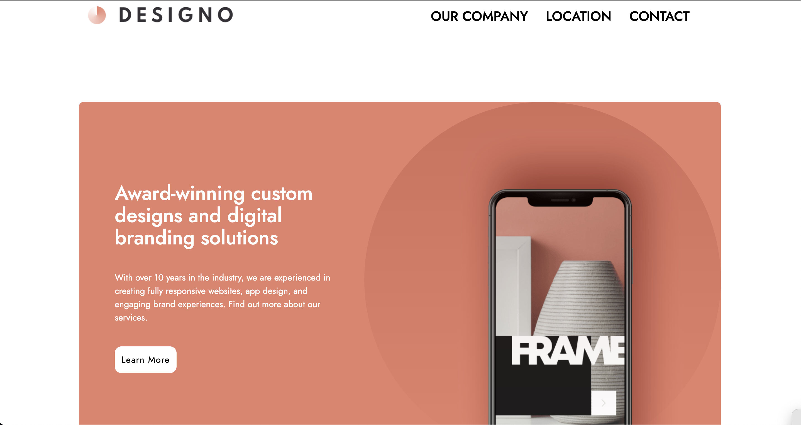

## Table of contents

- [Overview](#overview)
  - [Screenshot](#screenshot)
  - [Links](#links)
- [My process](#my-process)
  - [Built with](#built-with)
  - [What I learned](#what-i-learned)
  - [Continued development](#continued-development)
- [Acknowledgments](#acknowledgments)

## Overview

### Screenshot



### Links

- Live Site URL: [Demo](https://team-designo.netlify.app/)

## My process

Using the Figma provided I planned my first few hours. Because Tailwind is a mobile first utility class library, I set my development environment to build out the website mobile first. I collated the assets, images, and svgs into a public images folder and then started to build out the UI for the homepage.

Elements like the navigation, call to action, and footer would be reused across the pages so I made reusable components and included them in the \_\_app.tsx file, the main file rendering all our components.

This is a multipage website so I made a pages folder and added all the required JS page files. I then connected these pages using Next Links in my navigation, footer, and call to action buttons.

I then added animations on hover to buttons and elements.

### Built with

- Semantic HTML5 markup
- CSS custom properties
- Flexbox
- Mobile-first workflow
- [React](https://reactjs.org/) - JS library
- [Next.js](https://nextjs.org/) - React framework
- [TailwindCSS](https://tailwindcss.com/) - For styles

### What I learned

I learned that Tailwind CSS is natively mobile-first so things like media breakpoints go "Up" and mixing the order of things like md:bg-blue sm:bg-red instead of sm being before md, then breakpoints wont function correctly.

Some code i'm proud of is featured below. In this example, I realized that I would be creating a lot of repeated blocks so I decided to quickly build a JSON object with the title, image, and description for each of the blocks I needed to build.

If I was working with a database, I would create an API endpoint to fetch this JSON object from the database.

```js

const app_design_data = [
  {"title": "AIRFILTER", "image": "/images/image-airfilter.jpg", "description": "Solving the problem of poor indoor air quality by filtering the air"},
  {"title": "EYECAM", "image": "/images/image-eyecam.jpg", "description": "Product that lets you edit your favorite photos and videos at any time"},
  {"title": "FACEIT", "image": "/images/image-faceit.jpg", "description": "Get to meet your favorite internet superstar with the faceit app"},
  {"title": "TODO", "image": "/images/image-todo.jpg", "description": "A todo app that features cloud sync with light and dark mode"},
  {"title": "LOOPSTUDIOS", "image": "/images/image-loopstudios.jpg", "description": "A VR experience app made for Loopstudios"},
]

<div className='flex md:w-3/4 justify-center flex-wrap m-auto'>
  {/* I take the data array and iterate through each to show title, image, and description */}
  {app_design_data.map(item => {
    return (
      <div className='p-5 flex md:w-1/3'>
        <a className='cursor-grab group'>
          <div className='h-[478px] w-[350px] bg-[#FDF3F0] hover:bg-[#E7816B] text-center rounded-xl'>
            
            <h1 className='text-[#E7816B] group-hover:text-white text-xl tracking-[5px] my-4'>{item.title}</h1>
            <p className='text-black group-hover:text-white w-10/12 m-auto'>{item.description}</p>
          </div>
        </a>
      </div>
    )
  })}
</div>
```

### Continued development

I definitely think I could add a Dark Mode functionality using Tailwind. And I recognize that some of the elements on each page can be made into reusable components.

## Acknowledgments

Thanks to Flowbite for providing a library of responsive and customizable Tailwind solutions.
